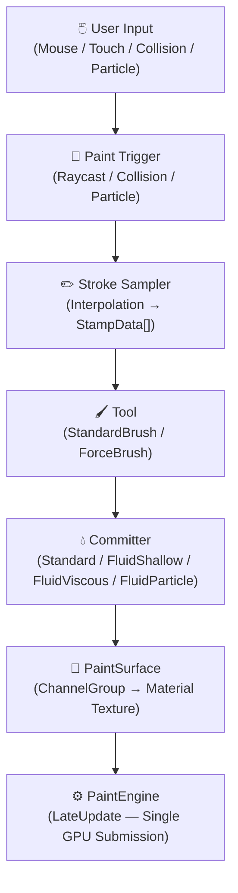

# 🏗️ Architecture Overview

SimplePainter is built on a **two-tier architecture**: a **GPU Command Pipeline** for rendering and a **Paint Node Hierarchy** for lifecycle management.

---

## ⚙️ Core Design Pillars

### 🔹 GPU Command Pipeline

A singleton `PaintEngine` collects `ICommand` objects each frame, sorts them into phase-ordered buckets, then executes them all in a single `CommandBuffer` during `LateUpdate`.

- **Single GPU submission** per frame via `Graphics.ExecuteCommandBuffer`
- **Phase-ordered execution**: Setup → Process → Draw → Commit → Composition
- **Profiler markers** for each phase for easy debugging

### 🔹 Paint Node Hierarchy

A composite tree of `IPaintNode` objects. `PaintSurface` (root) broadcasts a `PaintContext` depth-first. Each node reacts to the `PaintPhase` it cares about.

- **Depth-first traversal** ensures parent nodes initialize before children
- **Dirty flagging** minimizes unnecessary GPU work
- **Phase-selective** — nodes only respond to phases they handle

### 🔹 Object Pooling (CRTP)

`PooledCommand<TSelf>` uses the Curiously Recurring Template Pattern for zero-allocation command reuse. `CommandBufferPool` reuses Unity `CommandBuffer` instances.

```csharp
// Lấy command từ pool thay vì khởi tạo mới — zero allocation
var cmd = StandardDrawCommand.Get(visualRT, dynamicsRT, stamps, ...);
PaintEngine.EnqueueCommand(cmd);
// Sau khi thực thi, command tự động trả về pool
```

### 🔹 Strategy Pattern

`IShaderBinder<TInput>` decouples shader state setup from commands. Stroke methods, tools, and committers are all hot-swappable via the Strategy pattern.

- **Stroke Methods**: Bezier, Line, Dot, Anchored
- **Tools**: StandardBrush, DirectionalForceBrush, RadialForceBrush, TextureForceBrush
- **Committers**: Standard, FluidShallow, FluidViscous, FluidParticle

---

## 🌳 Node Hierarchy

The paint node tree follows a strict composite pattern:

```
PaintSurface                    — root MonoBehaviour, broadcasts PaintPhase
 └─ ChannelRegistry             — maps channels to shader properties
     └─ ChannelGroup            — composites all channels for one shader property
         └─ PaintChannel        — one runtime channel (e.g., Albedo, Normal)
             ├─ PaintLayer      — GPU render buffer (×N per channel)
             └─ ScratchBuffer   — live draft of the in-progress stroke
```

:::info Node Responsibilities
- **PaintSurface** — Manages `Paintable` sources, broadcasts lifecycle phases
- **ChannelRegistry** — Routes channel definitions to their shader properties
- **ChannelGroup** — Composites all layers + scratch into a final texture for one material slot
- **PaintChannel** — Owns the layer stack and scratch buffer for one channel type
- **PaintLayer** — Holds a `ManagedRenderTarget` with independent blend mode and opacity
- **ScratchBuffer** — Temporary "draft" layer for the current brush stroke
:::

---

## 🔄 Two Phase Systems

The system uses two *orthogonal* phase enums that govern different concerns:

| System | Enum | Values | Purpose |
|--------|------|--------|---------|
| `CommandPhase` | GPU ordering | Setup → Process → Draw → Commit → Composition | Orders GPU commands within a single frame's render batch |
| `PaintPhase` | Lifecycle | Initialize, Update, Reset, Clear, SourceChanged | Drives the node tree lifecycle events |

### CommandPhase (GPU Ordering)

Controls the **execution order of GPU commands** within a single frame:

1. **Setup** — Global setup, flow field baking, geometry data prep
2. **Process** — Fluid simulation physics steps
3. **Draw** — Brush stamp rendering onto ScratchBuffers
4. **Commit** — Scratch → persistent layer blending
5. **Composition** — Final compositing of all layers to material textures

### PaintPhase (Lifecycle)

Drives the **node tree lifecycle** across multiple frames:

- **Initialize** — First-time setup when a `Paintable` source is assigned
- **Update** — Per-frame update for active painting
- **Reset** — Restore all layers to their `InitTexture`
- **Clear** — Wipe all layers to default background
- **SourceChanged** — Triggered when the `Paintable` source switches

:::caution Don't Confuse the Two
`CommandPhase` orders GPU work *within* a single frame. `PaintPhase` drives the node *lifecycle* across frames. They are independent systems.
:::

---

## ⚡ Execution Flow

The complete journey of a paint stroke, from user input to GPU rendering:



---

<div style={{display: 'flex', justifyContent: 'space-between', marginTop: '2rem'}}>
  <a href="getting-started">← Previous: Getting Started</a>
  <a href="paint-engine">Next: PaintEngine →</a>
</div>
