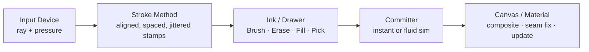

# Architecture & Execution Order

Every paint interaction flows through the same pipeline. A **Paint Tool** GameObject wires
together a `PaintInput`, a `PaintDrawer`, and (via assets) a stroke method and an ink
configuration. A separate **Canvas** GameObject hosts the channel/layer data and a
committer.

## The per-stroke pipeline

1. **Input device** — Mouse / Pen / Touch / Collision / Particle produces a ray + pressure.
2. **Stroke method** — shapes the ray into aligned, spaced and jittered stamps.
3. **Ink / Drawer** — Brush, Erase, Fill or Pick rasterises the stamps into a scratch buffer.
4. **Committer** — bakes the scratch into the layer, instantly or via a fluid simulation.
5. **Canvas / Material** — layers composite, seams get fixed, the material updates.

## Explicit execution order

Execution is deliberate: input and physics run first, the tool draws next, committers bake
after that, and the canvas composites last — all within the same frame. This is driven by
Unity's `DefaultExecutionOrder` attribute on each component:

| Order | Component | Responsibility |
| --- | --- | --- |
| `0` | Unity Physics / Input | Collisions, particle-collision events, raw device state |
| `100` | `PaintTool` | Polls the input, hands its stamp buffer to the drawer |
| `200` | `PaintCommitter` (Standard / FluidViscous) | Bakes or simulates the scratch buffer into a layer |
| `1000` | `PaintCanvas` | Composites layers, applies seam fixing, updates the material |

:::info Why this matters
Because every stage only ever *writes* to a scratch buffer and never clears someone else's
state, tools, strokes and committers can all be mixed and matched — a Bezier stroke can
drive a fluid simulation, a collision input can drive a plain brush — without any of the
pieces needing to know about each other.
:::

## Command phases inside a frame

Under the hood, the GPU work for a frame is recorded once into a single command buffer,
bucketed into five ordered phases and submitted with one execute call:

**Setup → Process → Draw → Commit → Composition**

- **Setup** — flow-field baking and geometry-data prep.
- **Process** — fluid-simulation physics steps.
- **Draw** — brush stamps rendered onto scratch buffers.
- **Commit** — scratch blended into a persistent layer.
- **Composition** — all layers composited to the material texture.

Frames with no paint activity submit nothing at all. See
[PaintEngine & Performance](./paint-engine.md) for the full command architecture.

---

*Next: [PaintEngine & Performance](./paint-engine.md)*
