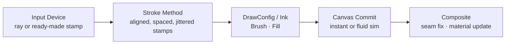

# Architecture & Execution Order

Every paint interaction flows through the same pipeline. A **Paint Tool** GameObject wires
together an `InputConfig`-driven reader and a `PaintDrawer`; a separate **Canvas**
GameObject hosts the channel/layer data and, for a `SimulationCanvas`, a fluid solver.

## The per-stroke pipeline

```mermaid
graph LR
    A["Input Device<br/>ray or ready-made stamp"] --> B["Stroke Method<br/>aligned, spaced, jittered stamps"]
    B --> C["DrawConfig / Ink<br/>Brush · Fill"]
    C --> D["Canvas Commit<br/>instant or fluid sim"]
    D --> E["Composite<br/>seam fix · material update"]
```

1. **Input device** — Mouse / Pen / Touch / Collision / Particle / Object produces a ray
   (or, for Object, a ready-made stamp straight from a transform).
2. **Stroke method** — shapes the ray into aligned, spaced and jittered stamps.
3. **DrawConfig / Ink** — Standard Brush or Fill Mesh rasterises the stamps into every
   target's scratch buffer.
4. **Canvas commit** — bakes the scratch into the layer, instantly, or by stepping a
   fluid solver first on a `SimulationCanvas`.
5. **Composite** — layers blend, seams get fixed, the material updates.

## Explicit execution order

Execution is deliberate: input and physics run first, the tool draws next, and the canvas
steps its simulation (if any), commits and composites last — all within the same frame.
This is driven by Unity's `DefaultExecutionOrder` attribute:

| Order | Component | Responsibility |
| --- | --- | --- |
| `0` | Unity Physics / Input | Collisions, particle-collision events, raw device state |
| `100` | `PaintTool` | Polls the input, hands its stamp buffer to the drawer |
| `1000` | `PaintCanvas` | Commits pending strokes (stepping its fluid solver first, on a `SimulationCanvas`), composites layers, applies seam fixing, updates the material |

:::info Why this matters
Because every stage only ever *writes* to a scratch buffer and never clears someone else's
state, tools, strokes, ink and solvers can all be mixed and matched — a Bezier stroke can
feed a fluid simulation, a collision input can drive a plain brush — without any of the
pieces needing to know about each other.
:::

## Command phases inside a frame

Under the hood, the GPU work for a frame is recorded once into a single command buffer,
bucketed into five ordered phases and submitted with one execute call:

**Setup → Process → Draw → Commit → Composition**

- **Setup** — flow-field baking and geometry-data prep.
- **Process** — fluid-simulation physics steps.
- **Draw** — brush stamps rendered onto scratch buffers.
- **Commit** — scratch blended into a persistent layer.
- **Composition** — all layers composited to the material texture.

Frames with no paint activity submit nothing at all. See
[PaintEngine & Performance](./paint-engine.md) for the full command architecture.

---

*Next: [PaintEngine & Performance](./paint-engine.md)*
