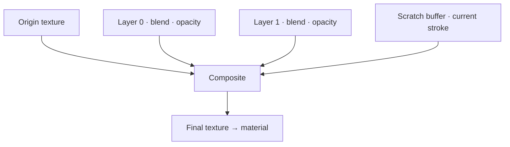

# Canvas, Channels & Layers

`PaintCanvas` is the main entry-point component. It hosts a list of `PaintChannel` entries,
discovers and manages one or many `Paintable` targets, and drives the whole system by
broadcasting lifecycle phases (`Initialize`, `Update`, `Reset`, `Clear`, `SourceChanged`)
down through its channel/layer tree every frame.

## Channels (ChannelDefinition)

Each **channel** is authored as a `ChannelDefinition` asset:

| Field | Description |
| --- | --- |
| **Value Type** | `Color`, `Scalar`, or `Normal` |
| **Shader Property / Keyword** | The target material property the channel drives |
| **Default Value** | Fallback value used before anything is painted |
| **Simulation Primary** | Optional — allocates a second buffer for fluid-dynamics data (velocity + mass) |

Because the shader property is fully configurable, a channel can drive albedo, a
metallic/smoothness mask, a normal map, or any other property your material exposes.

:::warning Simulation Primary
Enable **Simulation Primary** only on the channel that drives the
[fluid-viscous committer](./committers-fluid.md). It allocates an extra render target for
velocity + mass, so enabling it needlessly wastes GPU memory.
:::

## Layers (PaintLayer)

Each channel owns an independent stack of **layers** (`PaintLayer`): visibility, opacity,
an optional starting texture, and a blend mode. Blend modes are tracked **separately per
value type**, so switching a channel's type never misinterprets a setting that belonged to
a different family:

| Value type | Blend modes |
| --- | --- |
| **Color** | Normal, Multiply, Add, Min, Max, Screen, Overlay, Soft Light |
| **Scalar** | Normal, Multiply, Add, Min, Max |
| **Normal** | Lerp, RNM (Reoriented Normal Mapping), UDN, Whiteout, Overlay, Max Slope, Subtract |

## Compositing

Every frame a dirty channel is composited: the origin texture, then all visible layers
(bottom to top, each with its blend mode and opacity), then the in-progress scratch stroke,
producing the final texture set on the material.



## Multi-object canvas switching

At runtime, a canvas can register multiple `Paintable` targets and `Switch()` the active
one — useful for customizers with several parts or characters — reusing the same render
textures rather than reallocating GPU memory per switch:

```csharp
// Switch the active paintable by index or by reference.
paintCanvas.Switch(1);
paintCanvas.Switch(otherPaintable);

// Restore or wipe the current canvas.
paintCanvas.Reset();  // back to each layer's starting texture
paintCanvas.Clear();  // wipe to the default background
```

---

*Next: [Input & Stroke Methods](./triggers-strokes.md)*
