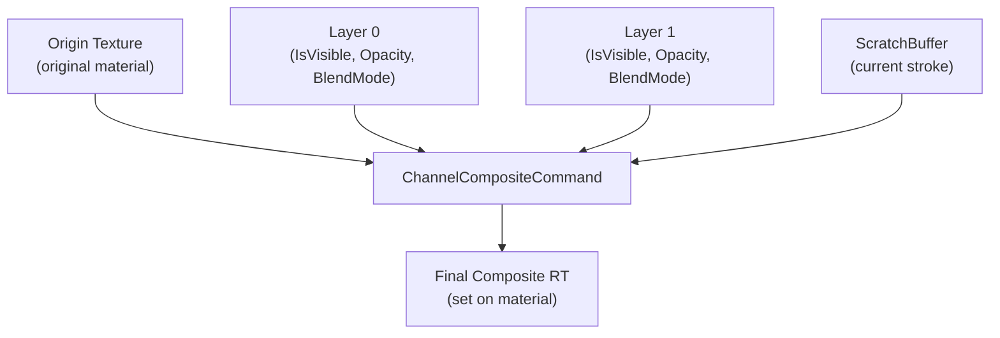

# 📚 Channels & Layers

Multi-channel PBR painting with per-channel blend modes and multi-layer compositing.

---

## 📝 ChannelDefinition (ScriptableObject)

Each channel is defined by a `ChannelDefinition` asset specifying what material property it controls:

| Field | Description |
|-------|-------------|
| `ShaderProperty` | Material texture slot name (e.g. `_MainTex`, `_BumpMap`) |
| `ValueType` | `Color`, `Normal`, or `Scalar` |
| `ChannelMask` | Which RGBA components to write (flags) |
| `IsSRGB` | Whether to use sRGB color space (Color only) |
| `EnableDynamicsTarget` | Allocates RT1 for fluid simulation velocity+mass |

### Creating a ChannelDefinition

Right-click in the **Project** window:

**Create → Deepwave / Simple Painter / Channel Definition**

:::info Common Configurations

| Channel | ShaderProperty | ValueType | ChannelMask | IsSRGB |
|---------|----------------|-----------|-------------|--------|
| Albedo | `_MainTex` | Color | RGBA | ✅ |
| Normal | `_BumpMap` | Normal | RGBA | ❌ |
| Metallic | `_MetallicGlossMap` | Scalar | R | ❌ |
| Roughness | `_MetallicGlossMap` | Scalar | A | ❌ |

:::

:::warning EnableDynamicsTarget
Set `EnableDynamicsTarget = true` only on the **primary** channel that drives fluid simulation. This allocates an additional `RT1` render target for velocity+mass data. Enabling it unnecessarily wastes GPU memory.
:::

---

## 🎨 PaintChannel

A runtime instance linked to a `ChannelDefinition`. Contains multiple `PaintLayer`s and a `ScratchBuffer`.

```csharp
// Lấy channel từ surface
var channel = paintSurface.GetChannel(albedoChannelDef);

// Truy cập danh sách layers
var layers = channel.Layers;

// Đặt layer đang hoạt động để vẽ
channel.ActiveLayerIndex = 2;

// Đánh dấu channel cần re-composition
channel.SetDirty();
```

:::tip SetDirty
Call `SetDirty()` whenever you programmatically modify a channel's layers (visibility, opacity, blend mode). This triggers the `ChannelGroup` to enqueue a `ChannelCompositeCommand` for re-compositing.
:::

---

## 🗂️ PaintLayer

Each layer owns a GPU `ManagedRenderTarget` and has independent visibility, opacity, blend mode, and an optional initial texture:

| Property | Description |
|----------|-------------|
| `IsVisible` | Toggle layer visibility (triggers re-composition) |
| `Opacity` | Layer opacity, 0–1 |
| `ColorBlendMode` | Blend mode for Color channels |
| `ScalarBlendMode` | Blend mode for Scalar channels |
| `NormalBlendMode` | Blend mode for Normal channels |
| `InitTexture` | Optional starting texture (applied on Reset) |

:::info Blend Mode Types
Blend modes are **type-specific** to prevent invalid combinations:
- **Color**: Normal, Multiply, Add, Min, Max, Screen, Overlay, SoftLight
- **Scalar**: Normal, Multiply, Add, Min, Max
- **Normal**: Lerp, RNM, UDN, Whiteout, Overlay, MaxSlope, Subtract
:::

---

## ✏️ ScratchBuffer

The "draft" layer holding the current brush stroke before it's committed:

- **RT0 (Visual)** — The painted value (what you see during the stroke)
- **RT1 (Dynamics)** — Optional simulation target (velocity + mass for fluid effects). Only allocated when `EnableDynamicsTarget = true`
- **`BlendDeposition`** — Positive values add coverage, negative values erase. Set by the committer.

```
Stroke in progress:
┌─────────────────────────────────────┐
│  RT0 (Visual)  │  RT1 (Dynamics)   │
│  Color/Normal  │  Velocity + Mass  │
│  values        │  (optional)       │
└─────────────────────────────────────┘
         │ BlendDeposition (+1 = draw, -1 = erase)
         ▼
    PaintLayer (persistent)
```

---

## 🔄 Compositing Flow

:::tip How Compositing Works
When a channel is dirty, `ChannelGroup` enqueues a `ChannelCompositeCommand` during the **Composition** phase. It composites:

1. **Origin texture** (the original material texture)
2. **+ All visible layers** (bottom to top, with per-layer blend modes)
3. **+ Scratch buffer** (the current in-progress stroke)
4. **→ Final composite render target** (set on the material)

This happens every frame that a channel is marked dirty, ensuring real-time visual feedback during painting.
:::

### Compositing Order



---

## 💡 Usage Examples

### Adding a New Layer at Runtime

```csharp
// Lấy channel và thêm layer mới
var channel = paintSurface.GetChannel(albedoChannelDef);

// Đặt opacity và blend mode cho layer mới
var layer = channel.Layers[channel.Layers.Count - 1];
layer.Opacity = 0.8f;
layer.ColorBlendMode = ColorBlendMode.Multiply;

// Đánh dấu channel dirty để kích hoạt re-composition
channel.SetDirty();
```

### Toggling Layer Visibility

```csharp
// Ẩn/hiện layer — tự động trigger re-composition
var layer = channel.Layers[0];
layer.IsVisible = !layer.IsVisible;
```

---

<div style={{display: 'flex', justifyContent: 'space-between', marginTop: '2rem'}}>
  <a href="paint-surface">← Previous: PaintSurface</a>
  <span></span>
</div>
