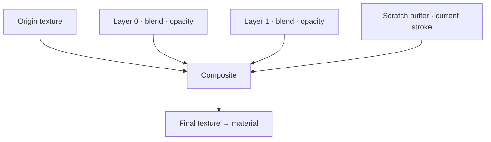

# Canvas, Channels & Layers

`PaintCanvas` is an abstract lifecycle host — it resolves the `Paintable` target, owns the
UV-seam environment, and drives the whole system by broadcasting lifecycle phases
(`Initialize`, `Update`, `Reset`, `Clear`, `SourceChanged`) down through its channel/layer
tree every frame. It also implements `IDrawContext` directly, so a `PaintDrawer` resolves
its stamp targets straight from the canvas — there is no separate per-canvas context
object. Three concrete canvases build on it.

## The three canvas types

| Canvas | Best for | Notes |
| --- | --- | --- |
| `MultiChannelCanvas` | The general case — several channels, each with its own layer stack | Populates the shared `ChannelTopology` that groups channels by shader property |
| `SimulationCanvas` | Physically simulated wet paint | Drives a shared `SimulationWorkspace`; needs a sibling fluid solver — see [Fluid Simulation](./committers-fluid.md) |
| `SingleTargetCanvas` | One channel, no layer stack, cheapest option | A stamp lands straight in its own buffer; one publish draw per dirty frame composites it over the material — no layer stack, no scratch, no shared topology |

## Channels (ChannelDefinition)

Each **channel** is authored as a `ChannelDefinition` asset:

| Field | Description |
| --- | --- |
| **Value Type** | `Color`, `Scalar`, or `Normal` |
| **Shader Property / Keyword** | The target material property the channel drives |
| **Default Value** | Fallback value used before anything is painted |
| **sRGB / Bit Depth** | Colour-space and precision settings for the channel's buffers |

Because the shader property is fully configurable, a channel can drive albedo, a
metallic/smoothness mask, a normal map, or any other property your material exposes.

## Layers (PaintLayer)

On a `MultiChannelCanvas` or `SimulationCanvas`, each channel owns an independent stack of
**layers** (`PaintLayer`): visibility, opacity, an optional starting texture, and a blend
mode. Blend modes are tracked **separately per value type**, so switching a channel's type
never misinterprets a setting that belonged to a different family:

| Value type | Blend modes |
| --- | --- |
| **Color** | Normal, Multiply, Add, Min, Max, Screen, Overlay, Soft Light |
| **Scalar** | Normal, Multiply, Add, Min, Max |
| **Normal** | Lerp, RNM (Reoriented Normal Mapping), UDN, Whiteout, Overlay, Max Slope, Subtract |

A `SingleTargetCanvas` skips layers and compositing entirely — a stamp lands straight on
its one buffer, which is why it's the cheapest of the three.

## Compositing

Every frame a dirty channel is composited: the origin texture, then all visible layers
(bottom to top, each with its blend mode and opacity), then the in-progress scratch stroke,
producing the final texture set on the material.


```mermaid
graph TD
    A["Origin texture"] --> E["Composite"]
    B["Layer 0 · blend · opacity"] --> E
    C["Layer 1 · blend · opacity"] --> E
    D["Scratch buffer · current stroke"] --> E
    E --> F["Final texture → material"]
```

## Retargeting at runtime

A canvas paints exactly one `Paintable` at a time. Call `SetTarget(...)` to point it at a
different object — the existing render textures are reused rather than reallocated:

```csharp
// Retarget the canvas onto a different paintable object.
paintCanvas.SetTarget(otherPaintable);

// Restore or wipe the current canvas.
paintCanvas.ResetToOrigin(); // back to each layer's starting texture
paintCanvas.Clear();         // wipe to the default background
```

---

*Next: [Input & Stroke Methods](./triggers-strokes.md)*
