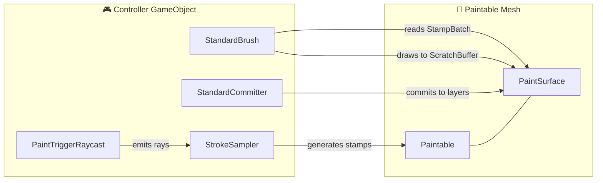

# 🚀 Getting Started

Get painting in minutes with this step-by-step setup guide.

---

## 📦 Installation

### Via Unity Package Manager (UPM)

1. Open **Window → Package Manager** in Unity
2. Click the **+** button → **Add package from git URL...**
3. Enter the package URL:

```
https://github.com/deepwavegame/com.deepwave.simplepainter.git
```

4. Click **Add** and wait for the import to complete

### Via Local Import

1. Download the package `.tgz` or clone the repository
2. Open **Window → Package Manager**
3. Click **+** → **Add package from disk...**
4. Navigate to the `package.json` file and select it

:::info Dependencies
SimplePainter requires the **Unity Input System** package for `PaintTriggerRaycast`. The Package Manager will prompt you to install it if missing.
:::

---

## 🎯 Minimal Scene Setup

Follow these 7 steps to create your first paintable scene:

### Step 1 — Create a ChannelDefinition Asset

Right-click in the **Project** window and select:

**Create → Deepwave / Simple Painter / Channel Definition**

Set the `ShaderProperty` to `_MainTex` to paint on the main albedo texture.

### Step 2 — Add PaintSurface + Paintable to Your Mesh

Select your mesh object in the scene and add:
- **PaintSurface** component
- **Paintable** component (auto-resolved if on the same GameObject)

Then add your `ChannelDefinition` to the surface's channel list.

:::tip Auto-Resolution
`PaintSurface` auto-resolves a `Paintable` from the same GameObject. You can also have multiple `Paintable` objects sharing one surface for multi-mesh painting.
:::

### Step 3 — Add StrokeSampler

Add `StrokeSampler` to a **controller** GameObject. Assign a `StrokeMethodConfig` ScriptableObject (e.g., the included **Bezier** config).

### Step 4 — Add PaintTriggerRaycast

Add `PaintTriggerRaycast` to the **same controller** object. Configure the Input Actions for paint and pointer input.

### Step 5 — Add StandardBrush

Add `StandardBrush` to the **same controller** object. Reference the `PaintSurface` and add a channel entry for your `ChannelDefinition`.

### Step 6 — Add StandardCommitter

Add `StandardCommitter` to the **same controller** object. Reference the `PaintSurface`.

### Step 7 — Press Play! 🎉

Enter Play mode and paint on your mesh!

---

## 🔄 Component Relationship Diagram



:::info Pull-Based Design
Tools don't receive events — they *poll* the surface's `StampBatch` every frame. The surface clears its batch in `LateUpdate` after all consumers have processed it.
:::

---

## 🌊 Adding Fluid Simulation

To enable fluid simulation on your paintable surface:

```csharp
// 1. Add a PaintEnvironment to the paintable object
// 2. Replace StandardCommitter with a SimulationPaintCommitter variant
// 3. Assign the PaintEnvironment to the PaintSurface:
paintSurface.PaintEnvironment = environment;

// 4. Enable dynamics on your ChannelDefinition (EnableDynamicsTarget = true)
// 5. Configure PBR channel bindings on the committer
//    (primary color channel + secondary smoothness/metallic/normal)
```

:::warning Enable DynamicsTarget
If you're using a `SimulationPaintCommitter`, make sure the primary `ChannelDefinition` has `EnableDynamicsTarget = true`. Without it, the simulation won't have a velocity+mass buffer to work with.
:::

---

## 🎨 Multi-Channel PBR Painting

Paint across multiple PBR channels simultaneously:

```csharp
// Create multiple ChannelDefinition assets:
//   Albedo   → _MainTex  (Color)
//   Normal   → _BumpMap  (Normal)
//   Metallic → _MetallicGlossMap (Scalar, mask: R)
//   Roughness → _MetallicGlossMap (Scalar, mask: A)

// Add all channels to PaintSurface
// Add matching ToolChannels to StandardBrush
// Toggle channels at runtime:
brush.Channels[0].Intensity = 1.0f;  // Albedo ON
brush.Channels[1].Intensity = 0.0f;  // Normal OFF
```

:::tip Channel Masks
Multiple channels can target the same shader property with different `ChannelMask` values. For example, Metallic writes to the R channel and Roughness writes to the A channel of `_MetallicGlossMap`.
:::

---

## 🔀 Runtime Switching

Swap configurations and targets at runtime without destroying objects:

```csharp
// Switch stroke method
strokeSampler.SwitchConfig(bezierConfig);

// Switch paintable target
paintSurface.Switch(otherPaintable);

// Reset / Clear the surface
paintSurface.Reset();  // Restore InitTexture
paintSurface.Clear();  // Wipe to default background
```

:::tip Swap Configs, Don't Mutate Assets
Use `strokeSampler.SwitchConfig(newConfig)` to change stroke behavior. This avoids mutating shared ScriptableObject assets and lets users revert by selecting another config.
:::

---

<div style={{display: 'flex', justifyContent: 'space-between', marginTop: '2rem'}}>
  <a href="product-overview">← Previous: Overview</a>
  <a href="architecture">Next: Architecture Overview →</a>
</div>
