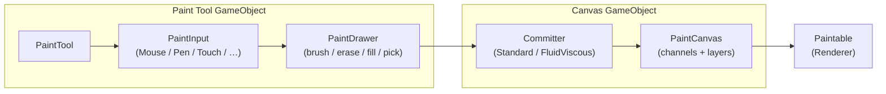

# Getting Started

A minimal paintable object needs a handful of components split across two roles: the
**canvas** (what gets painted) and the **tool** (what does the painting).

## Installation

1. Buy and download **Simple Paint 3D** from the
   [Unity Asset Store](https://assetstore.unity.com/packages/tools/painting/simple-paint-3d-375642).
2. In Unity, open **Window → Package Manager → My Assets**, then **Import** the package.
3. When prompted, also import its dependency **`com.deepwave.core`**.

:::tip Try before you build
Two playable WebGL demos are available on itch.io —
[demo 1](https://deepwave.itch.io/simple-painter-unity-demo) and
[demo 2](https://deepwave.itch.io/simple-painter-unity-demo-2).
:::

## The 7-step setup

### 1 — Make the object paintable

Add a `Paintable` component to the `Renderer` you want to paint. Set its **Texture Size**
(the resolution of every paint buffer for that object) and **Submesh Index**. It works
with regular meshes and with `SkinnedMeshRenderer` alike.

### 2 — Add the Canvas

Add a `PaintCanvas` component on the same object or a parent. Populate its **Channels**
list — one `PaintChannel` per material property you want to paint (e.g. Albedo, Normal,
Metallic), each pointing at a `ChannelDefinition` asset and holding one or more
`PaintLayer` entries.

### 3 — Add a Committer

On the same GameObject as the canvas, add `StandardCommitter` for instant painting, or
`FluidViscousCommitter` for physically-simulated wet paint (which needs a primary channel
binding).

### 4 — Build the Tool

On whichever object should receive player input, add `PaintTool` together with one
`PaintInput` and a `PaintDrawer`:

- `MousePaintInput`, `PenPaintInput`, `TouchPaintInput`, `CollisionPaintInput` or
  `ParticlePaintInput`.

`PaintTool` auto-resolves both the input and the drawer from the same GameObject if left
unassigned.

### 5 — Assign a Stroke

Create a stroke asset and assign it to the `PaintInput`:

`DirectStrokeConfig`, `DotStrokeConfig`, `DragDotStrokeConfig`, `LineStrokeConfig`,
`BezierStrokeConfig`, or `AnchoredStrokeConfig`.

### 6 — Assign an Ink Configuration

Create a tool asset — `StandardBrushConfig`, `EraseConfig`, `FillMeshConfig`, or
`PickConfig` — configure its ink channel list (colour/value, texture, intensity) and
assign it to the `PaintDrawer`.

### 7 — Optional: Seam Fixing & Progress

Add `PaintEnvironment` next to the `Paintable` for automatic UV seam fixing on
multi-island meshes, and/or `PaintProgressTracker` to measure paint completion at runtime.

## How the pieces connect

:::tip Hot-swappable by design
`PaintInput.SwitchStroke(...)` and `PaintDrawer.SwitchConfig(...)` can be called at
runtime, so a single Tool GameObject can flip between a brush and an eraser, or a Line
stroke and a Bezier stroke, without re-wiring components.
:::

---

*Next: [Architecture & Execution Order](./architecture.md)*
