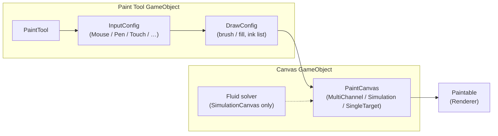

# Getting Started

A minimal paintable object needs a handful of components split across two roles: the
**canvas** (what gets painted) and the **tool** (what does the painting).

## Installation

1. Buy and download **Simple Paint 3D** from the
   [Unity Asset Store](https://assetstore.unity.com/packages/tools/painting/simple-paint-3d-375642).
2. In Unity, open **Window → Package Manager → My Assets**, then **Import** the package.
3. When prompted, also import its dependency **`com.deepwave.core`**.

:::tip Try before you build
Two playable WebGL demos are available on itch.io —
[demo 1](https://deepwave.itch.io/simple-painter-unity-demo) and
[demo 2](https://deepwave.itch.io/simple-painter-unity-demo-2).
:::

## The 8-step setup

### 1 — Make the object paintable

Add a `Paintable` component to the `Renderer` you want to paint. Set its **Texture Size**
(the resolution of every paint buffer for that object) and **Submesh Index**. It works
with regular meshes and with `SkinnedMeshRenderer` alike.

### 2 — Pick a canvas type

Add one of the following to the same object or a parent:

| Canvas | Best for |
| --- | --- |
| `MultiChannelCanvas` | The general case — several channels, each with its own layer stack |
| `SimulationCanvas` | Physically simulated wet paint |
| `SingleTargetCanvas` | One channel, no layer stack, the cheapest option |

### 3 — Configure its channels

- On a `MultiChannelCanvas`, populate **Channels** — one `PaintChannel` per material
  property, each pointing at a `ChannelDefinition` asset and holding one or more
  `PaintLayer` entries.
- On a `SimulationCanvas`, populate its `SimulationChannel` list the same way, plus a
  `ThicknessResponse` curve per channel.
- On a `SingleTargetCanvas`, just assign one `ChannelDefinition`.

### 4 — Simulation canvas only: add a solver

Add exactly one of `FluidViscousSimulation`, `FluidInkSimulation` or
`FluidFilmSimulation` as a sibling component — the canvas discovers it automatically.

### 5 — Build the Tool

On whichever object should receive player input, add `PaintTool` together with one
`InputConfig` asset:

`MouseInputConfig`, `PenInputConfig`, `TouchInputConfig`, `CollisionInputConfig`,
`ParticleInputConfig`, or `ObjectInputConfig`.

### 6 — Assign a DrawConfig

Create a tool asset — `StandardBrushConfig` or `FillMeshConfig` — configure its ink
channel list (colour/value, texture, intensity) and assign it to `PaintTool`.

### 7 — Optional: assign a stroke preset

Screen-based devices (Mouse/Pen/Touch) can take an optional `StrokeConfig` preset —
`LineStrokeConfig`, `BezierStrokeConfig`, `DragDotStrokeConfig` or
`AnchoredStrokeConfig` — for a shaped path instead of the one-stamp-per-ray default.

### 8 — Optional: progress tracking

Add `PaintProgressTracker` next to a `MultiChannelCanvas` or `SimulationCanvas` to
measure paint completion at runtime.

## How the pieces connect

```mermaid
graph LR
    subgraph Tool["Paint Tool GameObject"]
        PI["InputConfig<br/>(Mouse / Pen / Touch / …)"]
        PD["DrawConfig<br/>(brush / fill, ink list)"]
        PT["PaintTool"]
    end
    subgraph Canvas["Canvas GameObject"]
        PC["PaintCanvas<br/>(MultiChannel / Simulation / SingleTarget)"]
        FS["Fluid solver<br/>(SimulationCanvas only)"]
    end
    P["Paintable<br/>(Renderer)"]
    PT --> PI --> PD --> PC --> P
    FS -.-> PC
```

:::tip Hot-swappable by design
`PaintTool.SwitchInput(...)` and `PaintTool.SwitchPaint(...)` can be called at runtime, so
a single Tool GameObject can flip between a brush and a fill, or a Line stroke and a
Bezier stroke, without re-wiring components.
:::

---

*Next: [Architecture & Execution Order](./architecture.md)*
