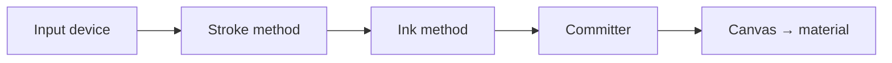

# Introduction

**Simple Painter** is a runtime 3D texture-painting system for Unity. It paints directly
onto meshes while the game is running — not just a flat colour, but any PBR material
channel (albedo, metallic, smoothness, normal maps and more), composited through a
multi-layer system similar to a digital image editor.

## Everything is a small, swappable module

The whole system is built from small pieces that snap together. A **Paint Tool** is
assembled from three independent parts:

- an **input device** that turns a mouse click, pen stroke, touch, physics collision or
  particle impact into raw stamps;
- a **stroke method** that shapes those stamps into a dot, a line, a curve, or a freehand
  trail;
- an **ink / paint method** that decides how those stamps are rasterised — a brush, an
  eraser, a bucket fill, or a colour picker.

A separate **committer** then bakes the result into a channel's layer stack — either
instantly, or through a physically-simulated wet-paint process.

Because every stage only ever *writes* to a scratch buffer and never clears another
stage's state, tools, strokes and committers can be mixed and matched freely — a Bezier
stroke can drive a fluid simulation, a collision input can drive a plain brush, and so on.

## Grounded in what actually ships

This documentation was written from a full read-through of the package's runtime source
(172 C# scripts across 10 modules), so every feature described reflects what is in the
package — not aspirational or planned functionality.

## Read next

- [Getting Started](./getting-started.md) — build a paintable object in 7 steps
- [Architecture & Execution Order](./architecture.md) — how a stroke flows through the frame
- [Canvas, Channels & Layers](./channels-layers.md) — the PBR channel/layer model
- [Input & Stroke Methods](./triggers-strokes.md) — the 5 devices and 6 strokes

---

*Next: [Getting Started](./getting-started.md)*
