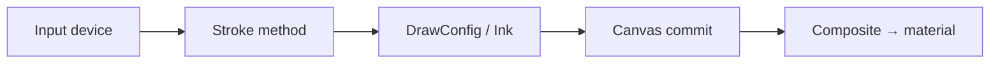

# Introduction

**Simple Painter** is a runtime 3D texture-painting system for Unity. It paints directly
onto meshes while the game is running — not just a flat colour, but any PBR material
channel (albedo, metallic, smoothness, normal maps and more), composited through a
multi-layer system similar to a digital image editor.

## Everything is a small, swappable module

The whole system is built from small pieces that snap together on two GameObjects. A
**Paint Tool** combines:

- an **input device** that turns a mouse click, pen stroke, touch, physics collision,
  particle impact, or a carried transform into raw stamps;
- an optional **stroke method** that shapes those stamps into a line, a curve, a
  following dab, or a resizable decal (screen devices only — leave it empty and every
  ray simply stamps where it lands);
- a **`DrawConfig`** that supplies both the stamp's *geometry* (shape, atlas mapping,
  facing/depth culling) and its *ink* — which channels it paints, and with what.

A separate **canvas** — one of three concrete types — then commits the result into a
channel's layer stack: instantly on a `MultiChannelCanvas`, or through a physically
simulated wet-paint process on a `SimulationCanvas`.

```mermaid
graph LR
    I["Input device"] --> S["Stroke method"]
    S --> K["DrawConfig / Ink"]
    K --> C["Canvas commit"]
    C --> V["Composite → material"]
```

Because every stage only ever *writes* to a scratch buffer and never clears another
stage's state, tools, strokes and canvases can be mixed and matched freely — a Bezier
stroke can drive a fluid simulation, a collision input can drive a plain brush, and so on.

## Grounded in what actually ships

This documentation was written from a full read-through of the package's runtime source
(194 C# scripts across 10 modules), so every feature described reflects what is in the
package — not aspirational or planned functionality.

## Read next

- [Getting Started](./getting-started.md) — build a paintable object in 8 steps
- [Architecture & Execution Order](./architecture.md) — how a stroke flows through the frame
- [Canvas, Channels & Layers](./channels-layers.md) — the three canvas types and the PBR channel/layer model
- [Input & Stroke Methods](./triggers-strokes.md) — the 6 devices and 5 strokes

---

*Next: [Getting Started](./getting-started.md)*
