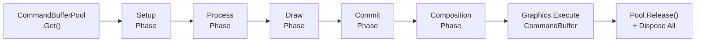

# 🔧 PaintEngine

The singleton GPU command dispatcher. Collects commands during the frame and executes them in one batch.

---

## ⚙️ How It Works

Every frame during `LateUpdate`, the engine executes a 5-step cycle:

1. **Get CommandBuffer** — Obtains a `CommandBuffer` from the pool
2. **Iterate Phases** — Processes commands in order: **Setup → Process → Draw → Commit → Composition**
3. **Record Commands** — For each phase, records all commands into the buffer (with profiler markers)
4. **Execute** — Calls `Graphics.ExecuteCommandBuffer` — **one single GPU submission**
5. **Cleanup** — Releases the buffer back to the pool and disposes all commands (returns to object pools)



:::info Single Submission
All paint operations across all surfaces, channels, and layers are batched into a **single** `Graphics.ExecuteCommandBuffer` call per frame. This minimizes GPU state changes and maximizes throughput.
:::

---

## 📝 Enqueuing Commands

Any system can enqueue a GPU command from anywhere during the frame:

```csharp
// Enqueue bất kỳ command nào vào pipeline
PaintEngine.EnqueueCommand(myCommand);

// Command thường được lấy từ object pool (zero allocation):
var cmd = StandardDrawCommand.Get(visualRT, dynamicsRT, stamps, ...);
PaintEngine.EnqueueCommand(cmd);
```

:::tip Object Pool Pattern
Commands are typically obtained from object pools via static `Get()` methods. After execution, `PaintEngine` calls `Dispose()` on each command, returning it to its pool automatically.
:::

---

## 📊 CommandPhase Execution Order

Each phase has a pre-allocated bucket with a fixed initial capacity. The bucket grows if needed, but the defaults are tuned for typical usage:

| Phase | Bucket Size | Purpose |
|-------|-------------|---------|
| `Setup` | 4 | Global setup, flow field baking, geometry data prep |
| `Process` | 8 | Fluid simulation physics steps |
| `Draw` | 128 | Brush stamp rendering onto ScratchBuffers |
| `Commit` | 16 | Scratch → persistent layer blending |
| `Composition` | 4 | Final compositing of all layers to material textures |

:::tip Why These Bucket Sizes?
- **Draw (128)** is the largest because each brush stroke can generate many stamp draw commands
- **Setup/Composition (4)** are small because there's typically one per surface
- **Process (8)** covers multiple fluid simulation substeps
- **Commit (16)** handles per-channel commits across multiple surfaces
:::

---

## 🔍 Profiler Integration

Each `CommandPhase` is wrapped in a Unity Profiler marker, making it easy to identify GPU bottlenecks:

```
SimplePainter.Setup
SimplePainter.Process
SimplePainter.Draw
SimplePainter.Commit
SimplePainter.Composition
```

:::info Profiler Markers
Use Unity's **Frame Debugger** and **Profiler** to inspect which commands are executing in each phase. This is invaluable for optimizing fluid simulation step counts and brush complexity.
:::

---

## 🏊 CommandBufferPool

The `CommandBufferPool` reuses Unity `CommandBuffer` objects to avoid GC allocations:

- `Get()` — Returns a pooled `CommandBuffer` (or creates one if the pool is empty)
- `Release()` — Returns the buffer to the pool after `ExecuteCommandBuffer`
- Buffers are automatically cleared before reuse

---

## ⚠️ Important Notes

:::warning Thread Safety
`PaintEngine.EnqueueCommand()` must be called from the **main thread** only. Commands are processed synchronously during `LateUpdate`.
:::

:::caution Command Lifecycle
Never reuse a command after it has been enqueued. The engine takes ownership and will call `Dispose()` after execution, returning pooled commands to their object pools.
:::

---

<div style={{display: 'flex', justifyContent: 'space-between', marginTop: '2rem'}}>
  <a href="architecture">← Previous: Architecture Overview</a>
  <a href="paint-surface">Next: PaintSurface →</a>
</div>
