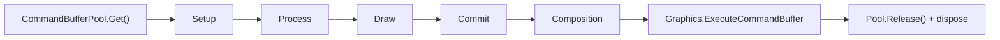

# PaintEngine & Performance

Simple Painter is built around a single-pass-per-frame command architecture rather than
scattered per-draw calls. `PaintEngine` is the GPU command dispatcher: it collects
commands during the frame and executes them in one batch.

## One command buffer per frame

Every frame, the engine runs a five-step cycle:

1. **Get a CommandBuffer** from the pool.
2. **Iterate phases** in order — Setup → Process → Draw → Commit → Composition.
3. **Record commands** for each phase into the buffer (each phase wrapped in a profiler marker).
4. **Execute** with a single `Graphics.ExecuteCommandBuffer` call.
5. **Cleanup** — release the buffer to the pool and dispose all commands back to their object pools.



:::info Frames with no paint activity submit nothing
Every GPU operation is a small, object-pooled command bucketed into one of five ordered
phases, recorded once and submitted with a single execute call. If nothing was painted
this frame, no command buffer is submitted at all.
:::

## Enqueuing commands

Any system can enqueue a GPU command during the frame. Commands are typically rented from
an object pool, so this is zero-allocation:

```csharp
// Rent a command from its pool instead of allocating a new one.
var cmd = StandardDrawCommand.Get(visualRT, dynamicsRT, stamps);
PaintEngine.EnqueueCommand(cmd);
// After execution the command is disposed back to its pool automatically.
```

## Pooling throughout

- **Commands, command buffers, materials, shared meshes and solid-colour textures** are
  all rented and reused instead of allocated per frame.
- **Render-texture pooling** — persistent simulation buffers are only reallocated when
  their format/size actually changes; short-lived scratch buffers route through Unity's
  native temporary render-texture pool; ping-pong buffer pairs standardise multi-pass
  simulation steps.
- **Guaranteed VRAM teardown** — every pooled render texture and cached solid texture is
  explicitly released when the paint engine shuts down.

## Batch raycasting & async readback

- **Job System batch raycasting** — dense per-frame stroke sampling (e.g. a fast Bezier
  stroke) automatically switches from a plain loop to parallel, job-scheduled raycasts once
  the batch is large enough to benefit.
- **Async GPU readback** — the Pick tool and Progress Tracker both use non-blocking
  `AsyncGPUReadback` exclusively, so sampling colours or measuring coverage never stalls
  the main thread.
- **Cross-platform format fallback** — render-target format selection automatically
  degrades from floating-point to normalized formats on platforms without float-blend
  support (e.g. WebGL without the relevant extension).

## Profiler markers

Each phase is wrapped in a Unity Profiler marker, making GPU bottlenecks easy to spot in
the **Profiler** and **Frame Debugger**:

```
SimplePainter.Setup
SimplePainter.Process
SimplePainter.Draw
SimplePainter.Commit
SimplePainter.Composition
```

:::caution Command lifecycle
`PaintEngine.EnqueueCommand()` must be called from the main thread. Never reuse a command
after enqueuing it — the engine takes ownership and disposes pooled commands after execution.
:::

---

*Next: [Paintable & Seam Fixing](./paint-surface.md)*
